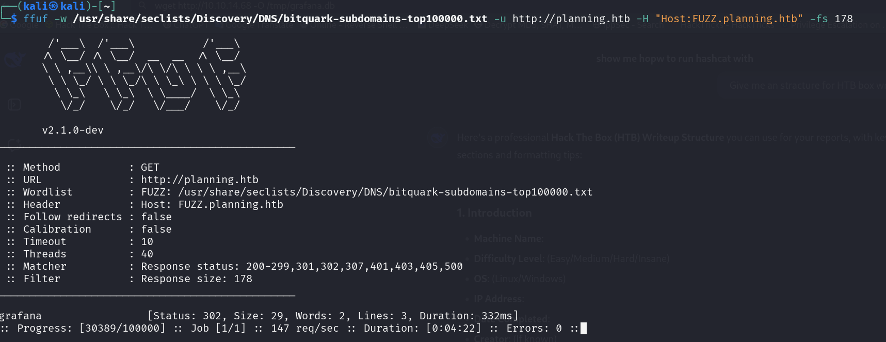
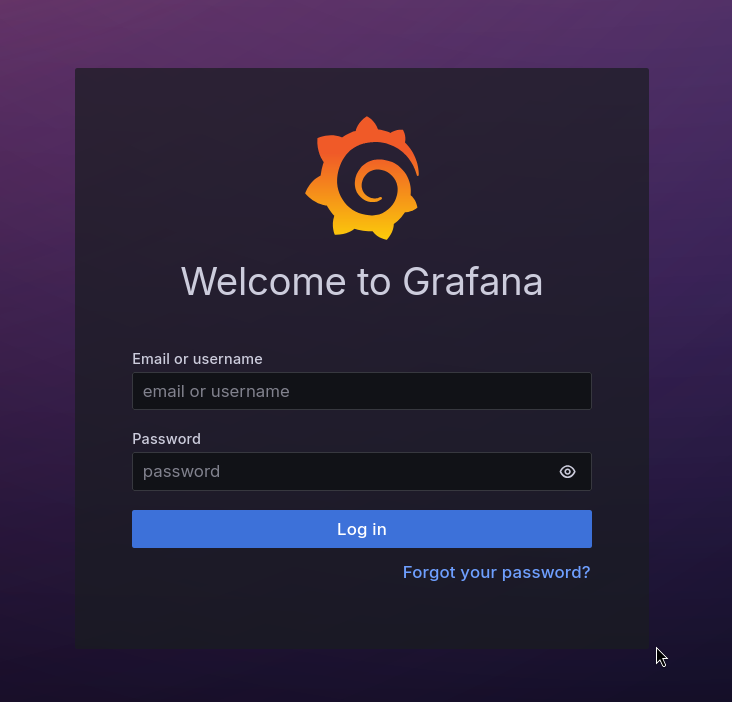
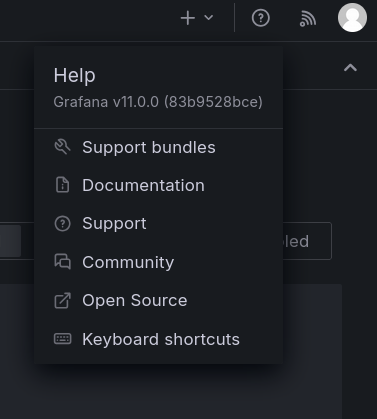
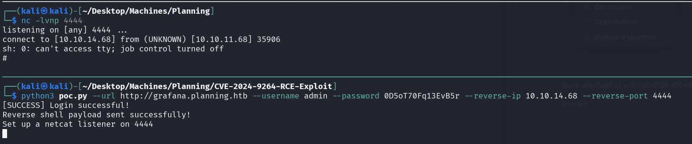
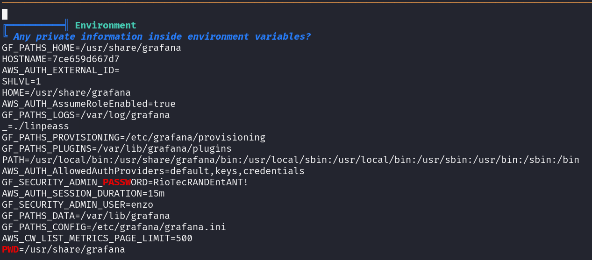
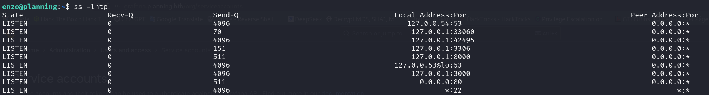
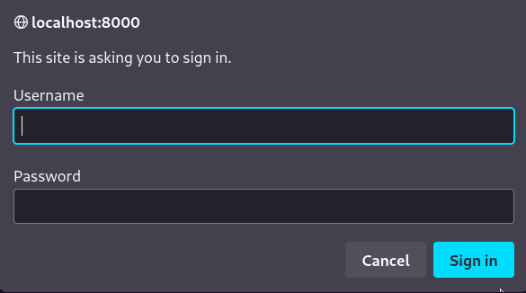
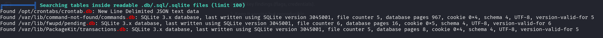
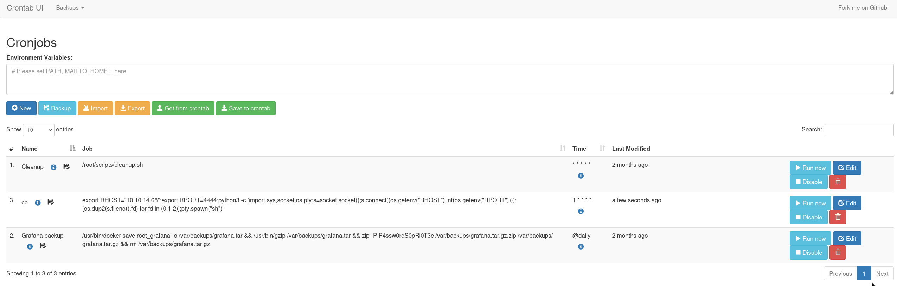
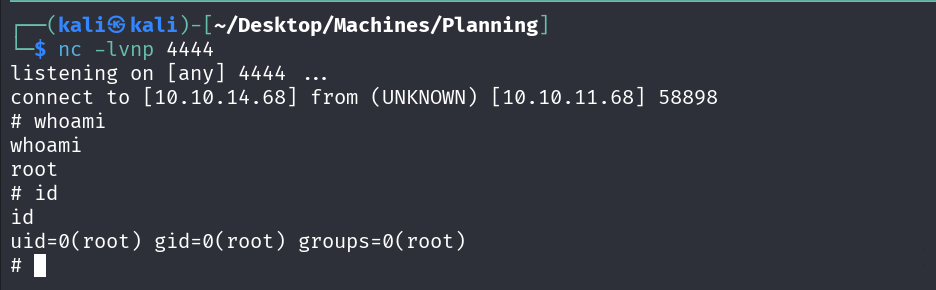

nmap scan showed the following opened ports:
# Nmap 7.95 scan initiated Sun May 11 11:39:23 2025 as: /usr/lib/nmap/nmap --privileged -sV -sC -oA nmap -v 10.10.11.68
Nmap scan report for 10.10.11.68
Host is up (0.32s latency).
Not shown: 998 closed tcp ports (reset)
PORT   STATE SERVICE VERSION
22/tcp open  ssh     OpenSSH 9.6p1 Ubuntu 3ubuntu13.11 (Ubuntu Linux; protocol 2.0)
| ssh-hostkey: 
|   256 62:ff:f6:d4:57:88:05:ad:f4:d3:de:5b:9b:f8:50:f1 (ECDSA)
|_  256 4c:ce:7d:5c:fb:2d:a0:9e:9f:bd:f5:5c:5e:61:50:8a (ED25519)
80/tcp open  http    nginx 1.24.0 (Ubuntu)
| http-methods: 
|_  Supported Methods: GET HEAD POST OPTIONS
|_http-server-header: nginx/1.24.0 (Ubuntu)
|_http-title: Did not follow redirect to http://planning.htb/
Service Info: OS: Linux; CPE: cpe:/o:linux:linux_kernel

Port 80:

Fuzzing for logging yielded nothing.

Fuzzing subdomains:

Here we go![]

Quick search got us with CVE-2024-9264-RCE-Exploit

And we are in (Rev-shell):

This is a Docker container ![].

Running linpeas got us with the creds for enzo.

SSH to the main box:

Local port forwarding:

ssh -L 8000:localhost:8000 enzo@10.10.11.68

Running linpeas on the main machine:

Logging in using credentianls from crontab.db

Executing the malicious cron:

